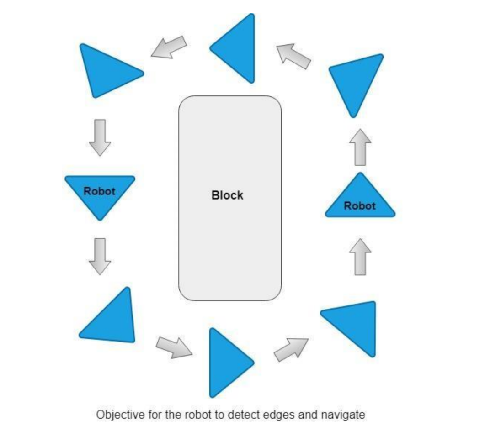

# Mobile robot Navigation using Artificial Neural Network

This repository describes the use of a simple artificial neural networks rather than a multi-layer neural
network to direct the navigation of mobile robot in a familiar and trained environment. A single layer
neural network trained with examples of values representing the typical static obstacles to be
experienced by the robot and the necessary actions to be taken . The model represents the rules
defining how the robot should move in order to make a circular path across the hall and to avoid a
clash against the obstacle. A back propagation algorithm is used to train the network. The model
has been implemented in robot as well as in simulation software. This report discloses the results of
the model that demonstrates the ability of the model in handling different obstacles placed at
random while in movement and the selection of the optimum parameters of the model. The
development of techniques for autonomous mobile robot operation constitutes one of the major
trends in the current research and practice in modern robotics

## AIM AND OBJECTIVE:
The comprehensive aim of this coursework is to inspect the application of deep learning approaches
to navigate mobile robots. In this report, a simple artificial neural network have been used to solve
mobile robots navigation challenges. The aim of autonomous mobile robots is to navigate and move
across physical objects without human intervention in real-world environments. The challenge is to
navigate the mobile robot by identifying the obstacles in front of it and to navigate in circular path
without colliding with the wall or obstacle. The data provided has covered different scenarios where
the robot has successfully made navigation and able to move without colliding the obstacles. The
different speed and velocity of the robot wheels is passed in the data according to its respective
sensor reading. The aim of the robot demonstration is also shown in the figure below

In this repo, the performance of the simple artificial neural network for mobile robot navigation
has been tested in real environment. The results proved that a neural network with one hidden layer
and four neurons performed extremely well upon testing in real environment and in simulator. It
proves that real time online training would yield satisfactory results in navigating robots when
regularisation and backpropagation with momentum is applied while training the network weights.
The main challenge in this problem was to detect the edges and obstacle and reduce and adjust the
velocity speed for both right and left wheels so that that the robot avoids collision and makes a
smooth turn across the wall, which was achieved effectively through this method. In future,
providing data reading of different kind of obstacles and training to its optimum level would help
tune the network to continuously navigate through the environment without any controllers.
